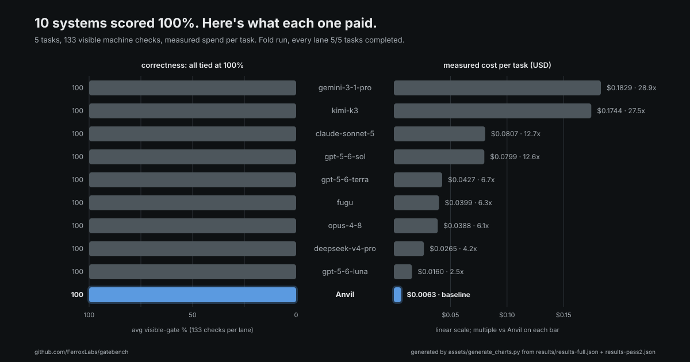

# GATEBENCH




**A public, verifiable benchmark of the gate-first executor thesis:** wrap a pool of cheap
models in a machine gate and you match or beat frontier models on correctness at a small
fraction of the cost. On 5 hard single-file tasks (196 machine checks: 133 visible + 63 hidden
that no builder ever sees), the gate-first lane (`anvil-v2`) scored **100% visible / 98%
hidden for $0.032 total** — the only 100%-visible lane under $0.08, with the next-cheapest at
2.5× and premium frontier lanes at 12.6–28.9×. The same cheap pool run *ungated* scores
**88% / 84%**; the gate is the entire lift. And in an objective re-score with formatting
black-normalized away, the gate-first code had the **highest maintainability (MI 51.6) and
fastest measured runtime (103 ms avg)** of the four lanes profiled, at 1/7 to 1/38 of their
cost. Every number below traces to a JSON in [`results/`](results/), and the core evidence
re-verifies on your machine, offline, in seconds.

## The money chart


*Generated by [`assets/generate_charts.py`](assets/generate_charts.py) from `results/*.json` —
run it to verify. Every point is computed from `results/results-full.json` +
`results/results-pass2.json`; the script cross-checks its aggregates against the shipped
[`results/table.md`](results/table.md) and refuses to draw on any mismatch. The two flagged
lanes are excluded from the plot: `fable-5` (router content-filter bug — 0 is not a capability
score) and `hermes` (empty output on every task, $0 measured spend, unplottable on a log cost
axis).*

Three more views of the same fold, all emitted by the same self-checking script:

- [`assets/cost-per-correct-task.svg`](assets/cost-per-correct-task.svg) — the 10 lanes that
  scored 100% visible, ranked by measured avg cost per task, with the cost multiple vs the
  gate-first lane on every bar.
- [`assets/four-ways-to-spend.svg`](assets/four-ways-to-spend.svg) — the fold grouped by
  approach (gated cheap pool / frontier solo / fusion systems / cheap solo): avg visible % and
  avg cost per task per group.
- [`assets/gated-vs-fusion.svg`](assets/gated-vs-fusion.svg) — the multi-model head-to-head:
  the gated climb vs the three fusion/ensemble products, visible and hidden gate % with cost
  per task under each system.

## Key results

Ranked by cost among lanes that hit 100% visible; the ungated control is included for
contrast. Full 20-lane table: [`results/table.md`](results/table.md).

| lane | via | visible% | hidden% | judge/10 | $ (5 tasks) | × vs gate-first |
|---|---|---:|---:|---:|---:|---:|
| **anvil-v2** (gate-first executor) | flux | **100** | **98** | 7.85 | **$0.032** | **1×** |
| gpt-5.6-luna | flux | 100 | 100 | 8.10 | $0.080 | 2.5× |
| deepseek-v4-pro | openrouter | 100 | 99 | 7.27 | $0.133 | 4.2× |
| opus-4.8 | flux | 100 | 98 | 7.47 | $0.194 | 6.1× |
| fugu (Sakana fusion) | system | 100 | 100 | 8.73 | $0.199 | 6.3× |
| gpt-5.6-terra | flux | 100 | 100 | 8.35 | $0.213 | 6.7× |
| gpt-5.6-sol | flux | 100 | 100 | 8.88 | $0.400 | 12.6× |
| claude-sonnet-5 | openrouter | 100 | 98 | 8.10 | $0.403 | 12.7× |
| kimi-k3 | openrouter | 100 | 100 | 8.82 | $0.872 | 27.5× |
| gemini-3.1-pro | openrouter | 100 | 100 | 7.90 | $0.915 | 28.9× |
| *minimax-solo (ungated control)* | flux | *88* | *84* | *6.72* | *$0.009* | — |

## Verify this yourself

Three commands. The first two need no API key and no network.

```bash
pip install -r requirements.txt   # black, radon, ruff, bandit — only for the objective tooling;
                                  # the verifier and gates below are pure stdlib

python verify/verify_results.py   # re-runs every visible + hidden gate against the ACTUAL
                                  # generated code embedded in results/results-objective.json
                                  # and asserts the recorded percentages reproduce exactly.
                                  # Current status: 18/18 embedded-code cells verified,
                                  # 0 mismatches; the 2 cells recorded as generation timeouts
                                  # (anvil-v2 expr_interp / csv_parse, shipped with no code)
                                  # are skipped and reported as such. Exits nonzero on any
                                  # mismatch.

python assets/generate_charts.py  # regenerates every chart in this README from results/*.json,
                                  # byte-identical output — git diff to confirm the images
                                  # match the shipped evidence
```

To go further:

```bash
export OPENROUTER_API_KEY=...
python runners/run_bench.py --lane deepseek-v4-pro   # re-run any OpenRouter lane at real retail
                                                     # (kimi-k3, glm-5-2, claude-sonnet-5,
                                                     #  gemini-3-1-pro, or any raw slug);
                                                     # writes results/results-local.json and
                                                     # never overwrites shipped evidence
python runners/agg.py                                # regenerate the ranked table
                                                     # (results/table-regen.md)
python runners/quality.py my_solution.py url_canon   # objective profile of any candidate file
python verify/leak_check.py                          # repo hygiene gate (CI)
```

## Formatting vs. substance: the objective re-score

The 3-model judge axis separated the ten 100%-visible lanes by only ~1.6 points (7.27–8.88),
and those deltas tracked polish. To settle whether cheap-gated code is objectively worse or
just less prettily formatted, four lanes were regenerated and profiled with formatting
equalized (`black`) before scoring — then measured with `ruff`, `bandit`, `radon`, and a
per-task runtime stress workload ([`METHODOLOGY.md`](METHODOLOGY.md) §3).


*Generated by [`assets/generate_charts.py`](assets/generate_charts.py) from
`results/results-objective.json` — run it to verify.*

With cosmetics normalized away, the gate-first lane tied on correctness (100%/100% on its
completed cells) and won both objective measures — MI 51.6 (vs 42.7–47.5) and 103.4 ms avg
runtime (vs 139.0–348.7 ms) — at $0.012 for the run vs $0.082 (gpt-5.6-luna), $0.251
(opus-4.8), and $0.453 (gpt-5.6-sol). It carried 2 real ruff findings (the frontier lanes had
0); they are reported in the JSON. Coverage caveat: its aggregates cover 3/5 tasks —
`expr_interp` and `csv_parse` timed out at generation in this re-score run and are recorded as
failures with no code (its 100% gate results for those two tasks come from the main run, climb
traces included in `results/results-full.json`).

## The gate is the lift

`minimax-solo` is the gate-first executor's own first-probe model, run bare, one-shot — the
±gate control. Ungated it averages 88% visible / 84% hidden, cracking to 48%/27% on the
expression interpreter. Wrapped in the gate — same cheap pool, non-regressive climb — it
reaches 100% / 98%.


*Generated by [`assets/generate_charts.py`](assets/generate_charts.py) from
`results/results-full.json` — run it to verify.*

The hidden gate is the control for gate-overfitting: no lane ever sees it, and the gated pool
holds 98.4% there — equal to opus-4.8. The climb is also cheap by construction: the loop stops
at one call whenever the first probe clears the gate (see the toposort trace,
`probe[minimax] 18/18 SOLVED — simple task, no ensemble needed $0.0007`, in the `anvil_log`
fields of `results/results-full.json`).

## How the benchmark works

20 lanes × 5 hard single-file Python tasks, four quality axes, per-call measured cost:

1. **Visible gate** — the machine contract the builder may see (133 checks).
2. **Hidden mutation gate** — adversarial checks no builder ever sees (63 checks).
3. **3-model LLM-judge rubric** — readability/robustness/edges/security from source only;
   judges never see gate results ([`rubric/QUALITY-RUBRIC.md`](rubric/QUALITY-RUBRIC.md)).
4. **Objective substance re-score** — black-normalize, then ruff/bandit/radon/measured runtime.

Every gate was validated at build time against a known-good reference (must score full) and a
known-bad mutant (must drop). Full protocol, task table, and measurement rules:
[`METHODOLOGY.md`](METHODOLOGY.md).

## What's in this repo

```
tasks/specs/     task specifications (the 5 v1.7 hard tasks + 7 earlier v1.6 tasks), verbatim
tasks/gates/     visible machine gates (pure stdlib, one per task) — the builder-facing contract
tasks/hidden/    hidden mutation gates (pure stdlib) — checks no builder ever saw
results/         every measurement JSON from the v1.7 run, verbatim (incl. embedded generated
                 code and the gate-first executor's full climb traces) + the ranked table
rubric/          the 3-model LLM-judge rubric (axis 3), verbatim
runners/         public OpenRouter runner, objective-quality profiler, table aggregator
verify/          verify_results.py (re-check shipped evidence) and leak_check.py (CI hygiene gate)
assets/          generate_charts.py + the SVG charts it emits (and this banner)
```

**The gate-first executor lane is the product under test — static evidence.** Its
implementation is not in this repository. Everything needed to *audit* its measured cells is:
scores, per-call costs, full climb traces (`anvil_log` in `results/results-full.json`), and
the actual generated code (`results/results-objective.json`), which you can re-score yourself,
offline, in seconds.

## Lane reproducibility

Three transports appear in the tables ([`MODELS.md`](MODELS.md) has the full lane-to-model
mapping):

- **openrouter** — five lanes (`deepseek-v4-pro`, `gemini-3-1-pro`, `claude-sonnet-5`,
  `kimi-k3`, `glm-5-2`) re-runnable today with `runners/run_bench.py` at real retail cost,
  scores and prices both.
- **flux** — measured through a private metered router using pinned aliases. The underlying
  model families are public and re-runnable through any provider; the exact pinned snapshots
  are not re-runnable from here. Static evidence here; family-level reproducible elsewhere.
- **system** — third-party fusion/agent products (`fugu`, `fugu-ultra`, `openrouter-fusion`,
  `hermes`) invoked at measurement time. Static evidence.

## Limitations

- **Scope:** single-file Python tasks. Nothing here speaks to multi-file, stateful, or
  non-Python work.
- **Operator-authored gates.** The task specs and both gate tiers were written by the
  benchmark operator, who also builds the product under test. The hidden gate, build-time
  known-good/known-bad gate validation, and the offline re-verifier are the mitigations —
  not a substitute for third-party task authorship.
- **Gates are not tamper-proof.** `verify_results.py` proves the shipped code reproduces the
  recorded scores against the shipped gates; it cannot prove how the code was produced.
- **N=1 per cell.** One generation per (lane, task). Directional, not a controlled trial.
- **The gate-first lane sees the visible gate during construction — by design.** That is its
  thesis. Solo lanes are one-shot and judged by the same gates. The hidden gate (never shown
  to any lane) is the gate-overfitting control: the gate-first lane holds 98% there.
- **Which lanes are static evidence:** everything not on OpenRouter (see
  [Lane reproducibility](#lane-reproducibility)); the gate-first lane itself is audit-only.
- **Judge-panel caveats.** Axis 3 is a 3-model LLM judge (median per dimension). Its deltas
  tracked formatting/polish more than substance — which is exactly why the objective re-score
  exists. Judges never see gate results, but LLM judges remain subjective instruments.
- **Objective-run coverage.** 2 of the gate-first lane's cells in the re-score run
  (expr_interp, csv_parse) are recorded generation timeouts with no code; its objective
  aggregates cover the 3 completed tasks.
- **Two lanes are flagged, not scored as capability:** `fable-5` (documented router
  content-filter bug; a bare-prompt OpenRouter retry ships as `fable-5-bare` in
  `results/results-fable.json`) and `hermes` (empty/timeout on every task — a reliability
  observation about that product, not a graded score).

## License

MIT. See [`LICENSE`](LICENSE). Full protocol: [`METHODOLOGY.md`](METHODOLOGY.md) · lane
mapping: [`MODELS.md`](MODELS.md).
